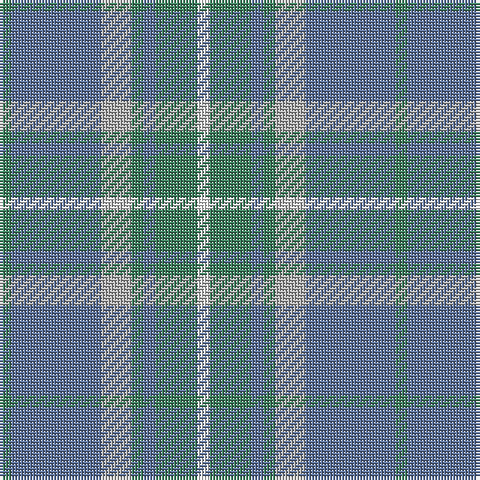

The parent of this is [Chambers Bay](/tartans/g/4/b30/n10/g4/b4/g14/w/4/)

This was sourced from register-of-tartans.  It is a [7 stripes tartan](/stripes/stripes7/).

Original link https://www.tartanregister.gov.uk/tartanDetails.aspx?ref=11350

## Thread count
G/4 B30 N10 G4 B4 G14 W/4

## Palette
Each colour and its ΔE from the base-6 reference it is a variant of.

| Colour | Shade | Base | ΔE (OKLab) |
|---|---|---|---|
| B |  `#5F749C` | B  | 0.17 |
| G |  `#408060` | G  | 0.13 |
| N |  `#B0B0B0` | Y  | 0.18 |
| W |  `#FFFFFF` | W  | 0.03 |

# Sample pattern

ID: /variants/g/4/b30/n10/g4/b4/g14/w/4-b5f749c-g408060-nb0b0b0-wffffff/
