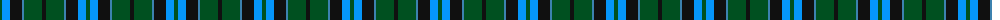

The parent of this is [Unidentified #28](/tartans/g/4/ba8/k12/b2/g18/k/4/)

This was sourced from register-of-tartans.  It is a [6 stripes tartan](/stripes/stripes6/).

Original link https://www.tartanregister.gov.uk/tartanDetails.aspx?ref=4229

## Thread count
G/4 Ba8 K12 B2 G18 K/4

## Palette
Each colour and its ΔE from the base-6 reference it is a variant of.

| Colour | Shade | Base | ΔE (OKLab) |
|---|---|---|---|
| B |  `#3C82AF` | B  | 0.20 |
| Ba |  `#0596FA` | B  | 0.28 |
| G |  `#005020` | G  | 0.08 |
| K |  `#101010` | K  | 0.17 |

# Sample pattern

ID: /variants/g/4/ba8/k12/b2/g18/k/4-b3c82af-ba0596fa-g005020-k101010/
