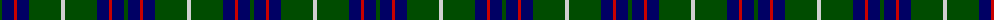

The parent of this is [MacIntyre L](/tartans/g/4/db12/r3/db12/g32/n/4/)

This was sourced from weddslist.  It is a [6 stripes tartan](/stripes/stripes6/).

Original link http://www.weddslist.com/cgi-bin/tartans/pg.pl?source=rb

## Thread count
G/4 DB12 R3 DB12 G32 N/4

## Palette
Each colour and its ΔE from the base-6 reference it is a variant of.

| Colour | Shade | Base | ΔE (OKLab) |
|---|---|---|---|
| DB |  `#000064` | B  | 0.17 |
| G |  `#004C00` | G  | 0.08 |
| N |  `#D0D0D0` | W  | 0.11 |
| R |  `#C80000` | R  | 0.00 |

# Sample pattern

ID: /variants/g/4/db12/r3/db12/g32/n/4-db000064-g004c00-nd0d0d0-rc80000/
