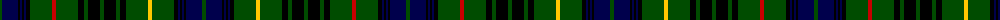

The parent of this is [Stewart Hunting](/tartans/g/4/db16/k2/db2/k2/db2/k4/g22/r4/g22/k6/g4/k12/g4/k12/g4/k6/g22/y4/g22/k4/db2/k2/db2/k2/db16/g/4/)

This was sourced from weddslist.  It is a [27 stripes tartan](/stripes/stripes27/).

Original link http://www.weddslist.com/cgi-bin/tartans/pg.pl?source=rb

## Thread count
G/4 DB16 K2 DB2 K2 DB2 K4 G22 R4 G22 K6 G4 K12 G4 K12 G4 K6 G22 Y4 G22 K4 DB2 K2 DB2 K2 DB16 G/4

## Palette
Each colour and its ΔE from the base-6 reference it is a variant of.

| Colour | Shade | Base | ΔE (OKLab) |
|---|---|---|---|
| DB |  `#00004C` | B  | 0.21 |
| G |  `#004C00` | G  | 0.08 |
| K |  `#000000` | K  | 0.00 |
| R |  `#C80000` | R  | 0.00 |
| Y |  `#FFC800` | Y  | 0.04 |

ID: /variants/g/4/db16/k2/db2/k2/db2/k4/g22/r4/g22/k6/g4/k12/g4/k12/g4/k6/g22/y4/g22/k4/db2/k2/db2/k2/db16/g/4-db00004c-g004c00-k000000-rc80000-yffc800/
