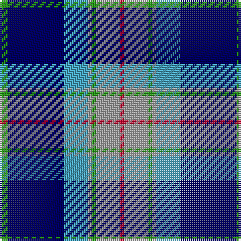

The parent of this is [Loch Ness in Scotland](/tartans/g/4/db28/b12/n2/g2/n12/r/2/)

This was sourced from register-of-tartans.  It is a [7 stripes tartan](/stripes/stripes7/).

Original link https://www.tartanregister.gov.uk/tartanDetails.aspx?ref=11569

## Thread count
G/4 DB28 B12 N2 G2 N12 R/2

## Palette
Each colour and its ΔE from the base-6 reference it is a variant of.

| Colour | Shade | Base | ΔE (OKLab) |
|---|---|---|---|
| B |  `#48A4C0` | Y  | 0.28 |
| DB |  `#000064` | B  | 0.17 |
| G |  `#289C18` | G  | 0.18 |
| N |  `#A0A0A0` | Y  | 0.20 |
| R |  `#C8002C` | R  | 0.03 |

# Sample pattern

ID: /variants/g/4/db28/b12/n2/g2/n12/r/2-b48a4c0-db000064-g289c18-na0a0a0-rc8002c/
