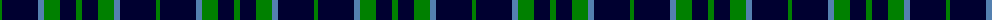
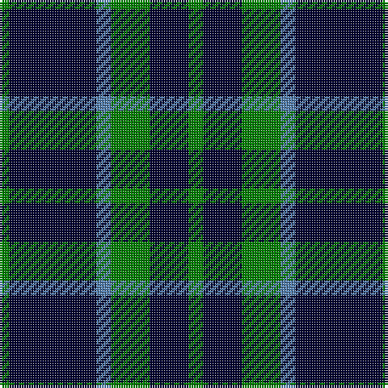

The parent of this is [Kincardine City](/tartans/g/4/db36/b6/g16/db16/g/6/)

This was sourced from weddslist.  It is a [6 stripes tartan](/stripes/stripes6/).

Original link http://www.weddslist.com/cgi-bin/tartans/pg.pl?source=sts

## Thread count
G/4 DB36 B6 G16 DB16 G/6

## Palette
Each colour and its ΔE from the base-6 reference it is a variant of.

| Colour | Shade | Base | ΔE (OKLab) |
|---|---|---|---|
| B |  `#5480B0` | B  | 0.20 |
| DB |  `#000030` | K  | 0.17 |
| G |  `#008000` | G  | 0.09 |

# Sample pattern

ID: /variants/g/4/db36/b6/g16/db16/g/6-b5480b0-db000030-g008000/
