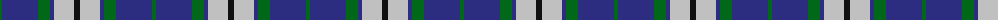
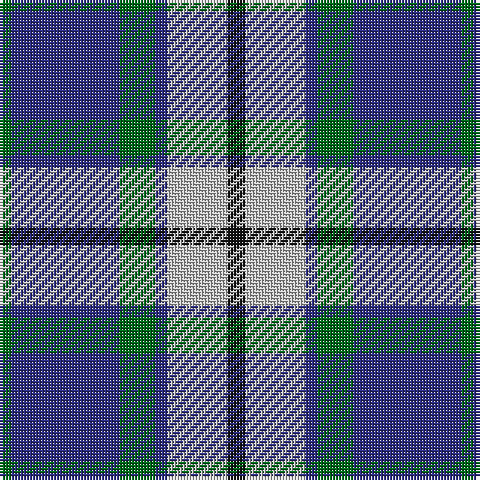

The parent of this is [Crombie House Check (Corporate)](/tartans/g/4/db36/g12/db4/n20/k/6/)

This was sourced from tartans-authority.  It is a [6 stripes tartan](/stripes/stripes6/).

Original link http://www.tartansauthority.com/tartan-ferret/display/2302/

## Thread count
G/4 DB36 G12 DB4 N20 K/6

## Palette
Each colour and its ΔE from the base-6 reference it is a variant of.

| Colour | Shade | Base | ΔE (OKLab) |
|---|---|---|---|
| DB |  `#2C2C80` | B  | 0.05 |
| G |  `#006818` | G  | 0.02 |
| K |  `#101010` | K  | 0.17 |
| N |  `#C0C0C0` | W  | 0.16 |

# Sample pattern

ID: /variants/g/4/db36/g12/db4/n20/k/6-db2c2c80-g006818-k101010-nc0c0c0/
