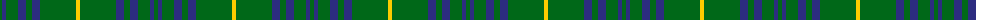
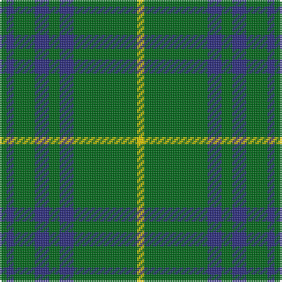

The parent of this is [Crow (Name)](/tartans/g/4/db4/g12/db8/g6/db8/g36/y/4/)

This was sourced from tartans-authority.  It is a [8 stripes tartan](/stripes/stripes8/).

Original link http://www.tartansauthority.com/tartan-ferret/display/8571/

## Thread count
G/4 DB4 G12 DB8 G6 DB8 G36 Y/4

## Palette
Each colour and its ΔE from the base-6 reference it is a variant of.

| Colour | Shade | Base | ΔE (OKLab) |
|---|---|---|---|
| DB |  `#2C2C80` | B  | 0.05 |
| G |  `#006818` | G  | 0.02 |
| Y |  `#FCCC00` | Y  | 0.04 |

# Sample pattern

ID: /variants/g/4/db4/g12/db8/g6/db8/g36/y/4-db2c2c80-g006818-yfccc00/
