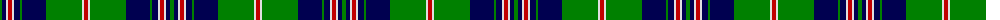

The parent of this is [MacKirgan](/tartans/g/4/db4/ln2/r4/ln2/db6/g2/db24/g36/ln2/r/4/)

This was sourced from weddslist.  It is a [11 stripes tartan](/stripes/stripes11/).

Original link http://www.weddslist.com/cgi-bin/tartans/pg.pl?source=sts

## Thread count
G/4 DB4 LN2 R4 LN2 DB6 G2 DB24 G36 LN2 R/4

## Palette
Each colour and its ΔE from the base-6 reference it is a variant of.

| Colour | Shade | Base | ΔE (OKLab) |
|---|---|---|---|
| DB |  `#000050` | B  | 0.20 |
| G |  `#008000` | G  | 0.09 |
| LN |  `#E0E0E0` | W  | 0.06 |
| R |  `#C00000` | R  | 0.02 |

ID: /variants/g/4/db4/ln2/r4/ln2/db6/g2/db24/g36/ln2/r/4-db000050-g008000-lne0e0e0-rc00000/
