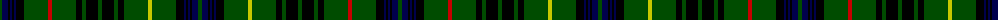

The parent of this is [Stewart Hunting D](/tartans/g/4/db6/k2/db2/k2/db2/k8/g24/r4/g24/k6/g4/k12/g4/k12/g4/k6/g24/y4/g24/k8/db2/k2/db2/k2/db6/g/4/)

This was sourced from weddslist.  It is a [27 stripes tartan](/stripes/stripes27/).

Original link http://www.weddslist.com/cgi-bin/tartans/pg.pl?source=rb

## Thread count
G/4 DB6 K2 DB2 K2 DB2 K8 G24 R4 G24 K6 G4 K12 G4 K12 G4 K6 G24 Y4 G24 K8 DB2 K2 DB2 K2 DB6 G/4

## Palette
Each colour and its ΔE from the base-6 reference it is a variant of.

| Colour | Shade | Base | ΔE (OKLab) |
|---|---|---|---|
| DB |  `#00004C` | B  | 0.21 |
| G |  `#004C00` | G  | 0.08 |
| K |  `#000000` | K  | 0.00 |
| R |  `#C80000` | R  | 0.00 |
| Y |  `#C8C800` | Y  | 0.05 |

ID: /variants/g/4/db6/k2/db2/k2/db2/k8/g24/r4/g24/k6/g4/k12/g4/k12/g4/k6/g24/y4/g24/k8/db2/k2/db2/k2/db6/g/4-db00004c-g004c00-k000000-rc80000-yc8c800/
