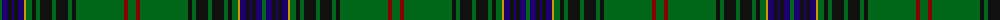

The parent of this is [Hyslop Hunting (Name)](/tartans/g/4/db6/k4/db2/k4/db6/dy2/g6/k4/g4/k12/g4/k12/g4/k4/g48/dr4/g/8/)

This was sourced from tartans-authority.  It is a [18 stripes tartan](/stripes/stripes18/).

Original link http://www.tartansauthority.com/tartan-ferret/display/3847/

## Thread count
G/4 DB6 K4 DB2 K4 DB6 DY2 G6 K4 G4 K12 G4 K12 G4 K4 G48 DR4 G/8

## Palette
Each colour and its ΔE from the base-6 reference it is a variant of.

| Colour | Shade | Base | ΔE (OKLab) |
|---|---|---|---|
| DB |  `#1C0070` | B  | 0.14 |
| DR |  `#880000` | R  | 0.14 |
| DY |  `#D09800` | Y  | 0.11 |
| G |  `#006818` | G  | 0.02 |
| K |  `#101010` | K  | 0.17 |

ID: /variants/g/4/db6/k4/db2/k4/db6/dy2/g6/k4/g4/k12/g4/k12/g4/k4/g48/dr4/g/8-db1c0070-dr880000-dyd09800-g006818-k101010/
