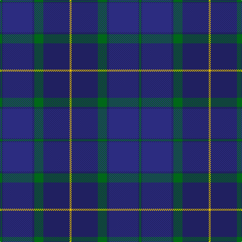

The parent of this is [Scottish Canals (Corporate)](/tartans/g/4/dba2/db58/dba4/g18/dba52/y/4/)

This was sourced from tartans-authority.  It is a [7 stripes tartan](/stripes/stripes7/).

Original link http://www.tartansauthority.com/tartan-ferret/display/3916/

## Thread count
G/4 DBa2 DB58 DBa4 G18 DBa52 Y/4

## Palette
Each colour and its ΔE from the base-6 reference it is a variant of.

| Colour | Shade | Base | ΔE (OKLab) |
|---|---|---|---|
| DB |  `#2C2C80` | B  | 0.05 |
| DBa |  `#202060` | B  | 0.11 |
| G |  `#006818` | G  | 0.02 |
| Y |  `#E8C000` | Y  | 0.00 |

# Sample pattern

ID: /variants/g/4/dba2/db58/dba4/g18/dba52/y/4-db2c2c80-dba202060-g006818-ye8c000/
