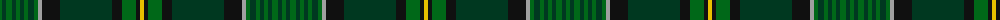

The parent of this is [Hanly Name Tartan Tartan Number: 9027. Earliest known date: 2009 About a year and a half ago Peter Hanly started looking into Hanly history and traditions and became quite interested in finding a tartan common to Hanlys. Hanly, from the Gaelic O'hAinle, has its roots in Ireland, and did not have a family tartan. Coming from Canada, and having no real connection to County Roscommon, Ireland (where the name Hanly originates) I decided to create a family tartan. The colours are based on the Hanly family coat of arms, a green shield with a silver boar passant between two silver arrows barways, the hooves, mane and arrowheads being of gold. Having had my grandfather, father and myself serve in the military (British Army, Canadian Army and Royal Canadian Airforce respectively), I have a strong connection to the military and thus tried to incorporate the thin green stripe design from the RCAF tartan. See products available Copyright © Blair Urquhart, Comrie, 2015](/tartans/g/4/dg4/g6/dg4/g4/dg4/g4/dg6/g4/n4/k18/dg52/k10/g14/k4/y/4/)

This was sourced from house-of-tartan.  It is a [16 stripes tartan](/stripes/stripes16/).

Original link http://www.house-of-tartan.scotland.net/house/TartanViewjs.asp?colr=Def&tnam=9027

## Thread count
G/4 DG4 G6 DG4 G4 DG4 G4 DG6 G4 N4 K18 DG52 K10 G14 K4 Y/4

## Palette
Each colour and its ΔE from the base-6 reference it is a variant of.

| Colour | Shade | Base | ΔE (OKLab) |
|---|---|---|---|
| DG |  `#003820` | G  | 0.16 |
| G |  `#006818` | G  | 0.02 |
| K |  `#101010` | K  | 0.17 |
| N |  `#A0A0A0` | Y  | 0.20 |
| Y |  `#E8C000` | Y  | 0.00 |

ID: /variants/g/4/dg4/g6/dg4/g4/dg4/g4/dg6/g4/n4/k18/dg52/k10/g14/k4/y/4-dg003820-g006818-k101010-na0a0a0-ye8c000/
