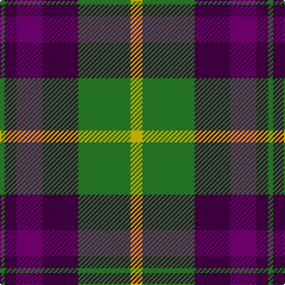

The parent of this is [Scottish Ballet](/tartans/g/4/dp10/p22/dp30/g44/y/10/)

This was sourced from tartans-authority.  It is a [6 stripes tartan](/stripes/stripes6/).

Original link http://www.tartansauthority.com/tartan-ferret/display/10896/

## Thread count
G/4 DP10 P22 DP30 G44 Y/10

## Palette
Each colour and its ΔE from the base-6 reference it is a variant of.

| Colour | Shade | Base | ΔE (OKLab) |
|---|---|---|---|
| DP |  `#440044` | B  | 0.17 |
| G |  `#288028` | G  | 0.09 |
| P |  `#780078` | B  | 0.16 |
| Y |  `#E8C000` | Y  | 0.00 |

# Sample pattern

ID: /variants/g/4/dp10/p22/dp30/g44/y/10-dp440044-g288028-p780078-ye8c000/
