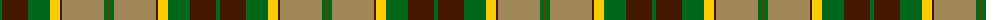

The parent of this is [St. Lawrence #2 (Fashion)](/tartans/g/4/dr26/g22/y10/dr2/lt42/g4/t/2/)

This was sourced from tartans-authority.  It is a [8 stripes tartan](/stripes/stripes8/).

Original link http://www.tartansauthority.com/tartan-ferret/display/2540/

## Thread count
G/4 DR26 G22 Y10 DR2 LT42 G4 T/2

## Palette
Each colour and its ΔE from the base-6 reference it is a variant of.

| Colour | Shade | Base | ΔE (OKLab) |
|---|---|---|---|
| DR |  `#441800` | B  | 0.22 |
| G |  `#006818` | G  | 0.02 |
| LT |  `#A08858` | Y  | 0.21 |
| T |  `#604000` | G  | 0.14 |
| Y |  `#FCCC00` | Y  | 0.04 |

# Sample pattern

ID: /variants/g/4/dr26/g22/y10/dr2/lt42/g4/t/2-dr441800-g006818-lta08858-t604000-yfccc00/
