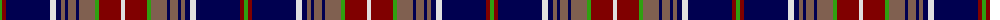

The parent of this is [Largs](/tartans/g/4/dr4/db44/ln6/db5/lt4/db3/lt8/db3/lt16/g4/dr22/ln/4/)

This was sourced from weddslist.  It is a [13 stripes tartan](/stripes/stripes13/).

Original link http://www.weddslist.com/cgi-bin/tartans/pg.pl?source=sts

## Thread count
G/4 DR4 DB44 LN6 DB5 LT4 DB3 LT8 DB3 LT16 G4 DR22 LN/4

## Palette
Each colour and its ΔE from the base-6 reference it is a variant of.

| Colour | Shade | Base | ΔE (OKLab) |
|---|---|---|---|
| DB |  `#000050` | B  | 0.20 |
| DR |  `#800000` | R  | 0.16 |
| G |  `#30A010` | G  | 0.19 |
| LN |  `#E0E0E0` | W  | 0.06 |
| LT |  `#806050` | R  | 0.17 |

ID: /variants/g/4/dr4/db44/ln6/db5/lt4/db3/lt8/db3/lt16/g4/dr22/ln/4-db000050-dr800000-g30a010-lne0e0e0-lt806050/
