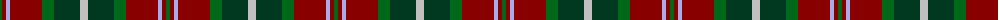
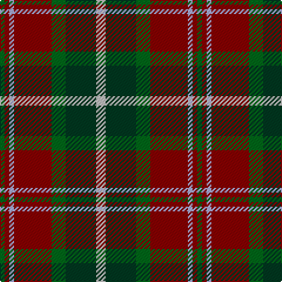

The parent of this is [Caledonian Brewery (Corporate)](/tartans/g/4/dr4/lp4/dr32/g12/dg26/n/8/)

This was sourced from tartans-authority.  It is a [7 stripes tartan](/stripes/stripes7/).

Original link http://www.tartansauthority.com/tartan-ferret/display/2315/

## Thread count
G/4 DR4 LP4 DR32 G12 DG26 N/8

## Palette
Each colour and its ΔE from the base-6 reference it is a variant of.

| Colour | Shade | Base | ΔE (OKLab) |
|---|---|---|---|
| DG |  `#003820` | G  | 0.16 |
| DR |  `#880000` | R  | 0.14 |
| G |  `#006818` | G  | 0.02 |
| LP |  `#A8ACE8` | W  | 0.22 |
| N |  `#C0C0C0` | W  | 0.16 |

# Sample pattern

ID: /variants/g/4/dr4/lp4/dr32/g12/dg26/n/8-dg003820-dr880000-g006818-lpa8ace8-nc0c0c0/
