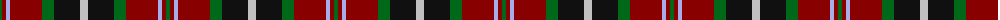
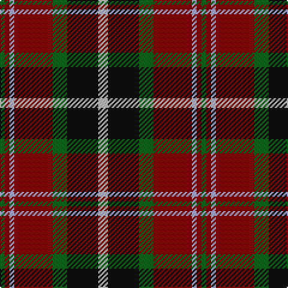

The parent of this is [Caledonian Brewery Corporate Tartan Tartan Number: 2315. Earliest known date: pre 1997 Designed by Kinloch Anderson Ltd to commemorate the opening of the new Caledonian Brewery Malting Building. See products available Copyright © Blair Urquhart, Comrie, 2015](/tartans/g/4/dr4/lp4/dr32/g12/k26/n/8/)

This was sourced from house-of-tartan.  It is a [7 stripes tartan](/stripes/stripes7/).

Original link http://www.house-of-tartan.scotland.net/house/TartanViewjs.asp?colr=Def&tnam=2315

## Thread count
G/4 DR4 LP4 DR32 G12 K26 N/8

## Palette
Each colour and its ΔE from the base-6 reference it is a variant of.

| Colour | Shade | Base | ΔE (OKLab) |
|---|---|---|---|
| DR |  `#880000` | R  | 0.14 |
| G |  `#006818` | G  | 0.02 |
| K |  `#101010` | K  | 0.17 |
| LP |  `#A8ACE8` | W  | 0.22 |
| N |  `#C0C0C0` | W  | 0.16 |

# Sample pattern

ID: /variants/g/4/dr4/lp4/dr32/g12/k26/n/8-dr880000-g006818-k101010-lpa8ace8-nc0c0c0/
