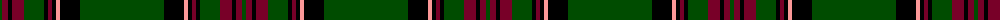

The parent of this is [Dryfe (Name)](/tartans/g/4/dr6/k4/dr12/g20/k4/dr4/k4/lr4/k20/g/84/)

This was sourced from tartans-authority.  It is a [11 stripes tartan](/stripes/stripes11/).

Original link http://www.tartansauthority.com/tartan-ferret/display/4724/

## Thread count
G/4 DR6 K4 DR12 G20 K4 DR4 K4 LR4 K20 G/84

## Palette
Each colour and its ΔE from the base-6 reference it is a variant of.

| Colour | Shade | Base | ΔE (OKLab) |
|---|---|---|---|
| DR |  `#780028` | R  | 0.18 |
| G |  `#004C00` | G  | 0.08 |
| K |  `#000000` | K  | 0.00 |
| LR |  `#FC9898` | Y  | 0.18 |

ID: /variants/g/4/dr6/k4/dr12/g20/k4/dr4/k4/lr4/k20/g/84-dr780028-g004c00-k000000-lrfc9898/
