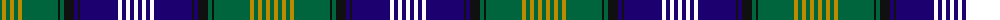

The parent of this is [Scottish Islamic (Corporate)](/tartans/g/4/dy4/g4/dy4/g4/dy4/g36/k2/g4/k10/db4/k2/db38/w4/db4/w4/db4/w/4/)

This was sourced from tartans-authority.  It is a [18 stripes tartan](/stripes/stripes18/).

Original link http://www.tartansauthority.com/tartan-ferret/display/10644/

## Thread count
G/4 DY4 G4 DY4 G4 DY4 G36 K2 G4 K10 DB4 K2 DB38 W4 DB4 W4 DB4 W/4

## Palette
Each colour and its ΔE from the base-6 reference it is a variant of.

| Colour | Shade | Base | ΔE (OKLab) |
|---|---|---|---|
| DB |  `#1C0070` | B  | 0.14 |
| DY |  `#BC8C00` | Y  | 0.16 |
| G |  `#00643C` | G  | 0.06 |
| K |  `#101010` | K  | 0.17 |
| W |  `#FCFCFC` | W  | 0.03 |

ID: /variants/g/4/dy4/g4/dy4/g4/dy4/g36/k2/g4/k10/db4/k2/db38/w4/db4/w4/db4/w/4-db1c0070-dybc8c00-g00643c-k101010-wfcfcfc/
