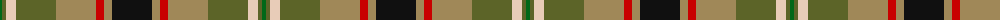
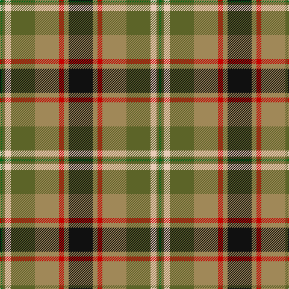

The parent of this is [Hackett Hunting (Personal)](/tartans/g/4/ga4/lr10/ga40/lt40/r8/lt8/k/40/)

This was sourced from tartans-authority.  It is a [8 stripes tartan](/stripes/stripes8/).

Original link http://www.tartansauthority.com/tartan-ferret/display/10783/

## Thread count
G/4 Ga4 LR10 Ga40 LT40 R8 LT8 K/40

## Palette
Each colour and its ΔE from the base-6 reference it is a variant of.

| Colour | Shade | Base | ΔE (OKLab) |
|---|---|---|---|
| G |  `#006818` | G  | 0.02 |
| Ga |  `#5C6428` | G  | 0.09 |
| K |  `#101010` | K  | 0.17 |
| LR |  `#E8CCB8` | W  | 0.11 |
| LT |  `#A08858` | Y  | 0.21 |
| R |  `#C80000` | R  | 0.00 |

# Sample pattern

ID: /variants/g/4/ga4/lr10/ga40/lt40/r8/lt8/k/40-g006818-ga5c6428-k101010-lre8ccb8-lta08858-rc80000/
