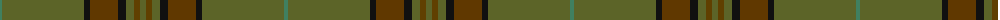

The parent of this is [Huntsman](/tartans/g/4/ga82/k6/t28/k8/ga8/ta6/ga/6/)

This was sourced from tartans-authority.  It is a [8 stripes tartan](/stripes/stripes8/).

Original link http://www.tartansauthority.com/tartan-ferret/display/8561/

## Thread count
G/4 Ga82 K6 T28 K8 Ga8 Ta6 Ga/6

## Palette
Each colour and its ΔE from the base-6 reference it is a variant of.

| Colour | Shade | Base | ΔE (OKLab) |
|---|---|---|---|
| G |  `#408060` | G  | 0.13 |
| Ga |  `#5C6428` | G  | 0.09 |
| K |  `#101010` | K  | 0.17 |
| T |  `#603800` | G  | 0.16 |
| Ta |  `#604000` | G  | 0.14 |

# Sample pattern

ID: /variants/g/4/ga82/k6/t28/k8/ga8/ta6/ga/6-g408060-ga5c6428-k101010-t603800-ta604000/
