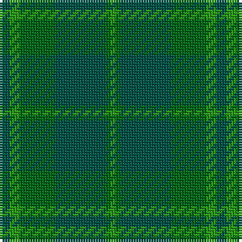

The parent of this is [Emerald, The](/tartans/g/4/gb4/ga14/g20/ga2/gb/2/)

This was sourced from register-of-tartans.  It is a [6 stripes tartan](/stripes/stripes6/).

Original link https://www.tartanregister.gov.uk/tartanDetails.aspx?ref=1109

## Thread count
G/4 Gb4 Ga14 G20 Ga2 Gb/2

## Palette
Each colour and its ΔE from the base-6 reference it is a variant of.

| Colour | Shade | Base | ΔE (OKLab) |
|---|---|---|---|
| G |  `#005448` | G  | 0.11 |
| Ga |  `#006818` | G  | 0.02 |
| Gb |  `#289C18` | G  | 0.18 |

# Sample pattern

ID: /variants/g/4/gb4/ga14/g20/ga2/gb/2-g005448-ga006818-gb289c18/
