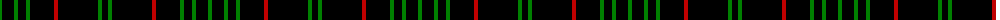

The parent of this is [Renwick](/tartans/g/4/k12/g4/k8/g4/k24/r4/k40/g4/k/6/)

This was sourced from weddslist.  It is a [10 stripes tartan](/stripes/stripes10/).

Original link http://www.weddslist.com/cgi-bin/tartans/pg.pl?source=sts

## Thread count
G/4 K12 G4 K8 G4 K24 R4 K40 G4 K/6

## Palette
Each colour and its ΔE from the base-6 reference it is a variant of.

| Colour | Shade | Base | ΔE (OKLab) |
|---|---|---|---|
| G |  `#008000` | G  | 0.09 |
| K |  `#000000` | K  | 0.00 |
| R |  `#C00000` | R  | 0.02 |

ID: /variants/g/4/k12/g4/k8/g4/k24/r4/k40/g4/k/6-g008000-k000000-rc00000/
