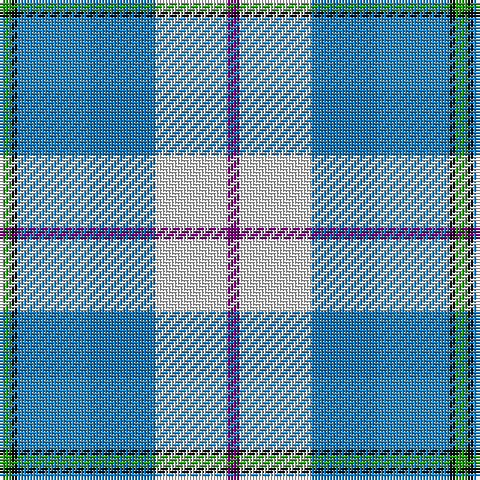

The parent of this is [Isle of Barra (District)](/tartans/g/4/k2/ba24/b22/ln24/p/4/)

This was sourced from tartans-authority.  It is a [6 stripes tartan](/stripes/stripes6/).

Original link http://www.tartansauthority.com/tartan-ferret/display/7623/

## Thread count
G/4 K2 Ba24 B22 LN24 P/4

## Palette
Each colour and its ΔE from the base-6 reference it is a variant of.

| Colour | Shade | Base | ΔE (OKLab) |
|---|---|---|---|
| B |  `#1474B4` | B  | 0.15 |
| Ba |  `#2888C4` | B  | 0.21 |
| G |  `#289C18` | G  | 0.18 |
| K |  `#101010` | K  | 0.17 |
| LN |  `#E0E0E0` | W  | 0.06 |
| P |  `#780078` | B  | 0.16 |

# Sample pattern

ID: /variants/g/4/k2/ba24/b22/ln24/p/4-b1474b4-ba2888c4-g289c18-k101010-lne0e0e0-p780078/
