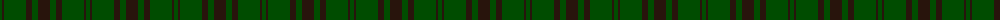
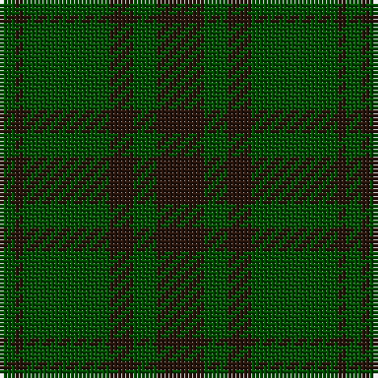

The parent of this is [Carnet (Fashion)](/tartans/g/4/k2/g22/k6/g6/k/12/)

This was sourced from tartans-authority.  It is a [6 stripes tartan](/stripes/stripes6/).

Original link http://www.tartansauthority.com/tartan-ferret/display/4464/

## Thread count
G/4 K2 G22 K6 G6 K/12

## Palette
Each colour and its ΔE from the base-6 reference it is a variant of.

| Colour | Shade | Base | ΔE (OKLab) |
|---|---|---|---|
| G |  `#004C00` | G  | 0.08 |
| K |  `#28140C` | K  | 0.22 |

# Sample pattern

ID: /variants/g/4/k2/g22/k6/g6/k/12-g004c00-k28140c/
