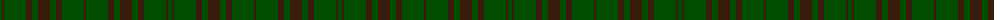

The parent of this is [Carnet](/tartans/g/4/k2/g22/k6/g6/k12/g6/k6/g22/k/2/)

This was sourced from register-of-tartans.  It is a [10 stripes tartan](/stripes/stripes10/).

Original link https://www.tartanregister.gov.uk/tartanDetails.aspx?ref=571

## Thread count
G/4 K2 G22 K6 G6 K12 G6 K6 G22 K/2

## Palette
Each colour and its ΔE from the base-6 reference it is a variant of.

| Colour | Shade | Base | ΔE (OKLab) |
|---|---|---|---|
| G |  `#004C00` | G  | 0.08 |
| K |  `#381C0C` | B  | 0.21 |
| Ka |  `#28140C` | K  | 0.22 |

ID: /variants/g/4/k2/g22/k6/g6/k12/g6/k6/g22/k/2-g004c00-k381c0c-ka28140c/
