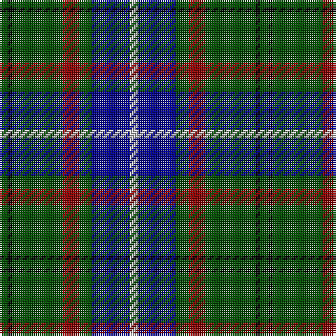

The parent of this is [Lee (Name)](/tartans/g/4/k2/g24/dr8/g6/db18/n/4/)

This was sourced from tartans-authority.  It is a [7 stripes tartan](/stripes/stripes7/).

Original link http://www.tartansauthority.com/tartan-ferret/display/5407/

## Thread count
G/4 K2 G24 DR8 G6 DB18 N/4

## Palette
Each colour and its ΔE from the base-6 reference it is a variant of.

| Colour | Shade | Base | ΔE (OKLab) |
|---|---|---|---|
| DB |  `#00008C` | B  | 0.13 |
| DR |  `#8C0000` | R  | 0.13 |
| G |  `#004C00` | G  | 0.08 |
| K |  `#000000` | K  | 0.00 |
| N |  `#C8C8C8` | W  | 0.13 |

# Sample pattern

ID: /variants/g/4/k2/g24/dr8/g6/db18/n/4-db00008c-dr8c0000-g004c00-k000000-nc8c8c8/
