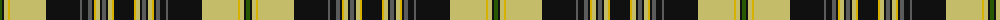

The parent of this is [Raznotravie (Corporate)](/tartans/g/4/k2/lg4/y2/lg36/k34/n2/k6/n4/k2/y2/lg4/k2/n4/k2/lg4/y2/k/20/)

This was sourced from tartans-authority.  It is a [18 stripes tartan](/stripes/stripes18/).

Original link http://www.tartansauthority.com/tartan-ferret/display/10771/

## Thread count
G/4 K2 LG4 Y2 LG36 K34 N2 K6 N4 K2 Y2 LG4 K2 N4 K2 LG4 Y2 K/20

## Palette
Each colour and its ΔE from the base-6 reference it is a variant of.

| Colour | Shade | Base | ΔE (OKLab) |
|---|---|---|---|
| G |  `#285800` | G  | 0.04 |
| K |  `#101010` | K  | 0.17 |
| LG |  `#C4BC68` | Y  | 0.07 |
| N |  `#5C5C5C` | B  | 0.14 |
| Y |  `#D8B000` | Y  | 0.05 |

ID: /variants/g/4/k2/lg4/y2/lg36/k34/n2/k6/n4/k2/y2/lg4/k2/n4/k2/lg4/y2/k/20-g285800-k101010-lgc4bc68-n5c5c5c-yd8b000/
