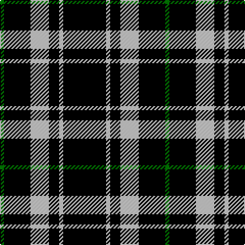

The parent of this is [New Zealand (2000) (Fashion)](/tartans/g/4/k26/n18/k10/n4/k/42/)

This was sourced from tartans-authority.  It is a [6 stripes tartan](/stripes/stripes6/).

Original link http://www.tartansauthority.com/tartan-ferret/display/4215/

## Thread count
G/4 K26 N18 K10 N4 K/42

## Palette
Each colour and its ΔE from the base-6 reference it is a variant of.

| Colour | Shade | Base | ΔE (OKLab) |
|---|---|---|---|
| G |  `#007800` | G  | 0.06 |
| K |  `#000000` | K  | 0.00 |
| N |  `#C8C8C8` | W  | 0.13 |

# Sample pattern

ID: /variants/g/4/k26/n18/k10/n4/k/42-g007800-k000000-nc8c8c8/
