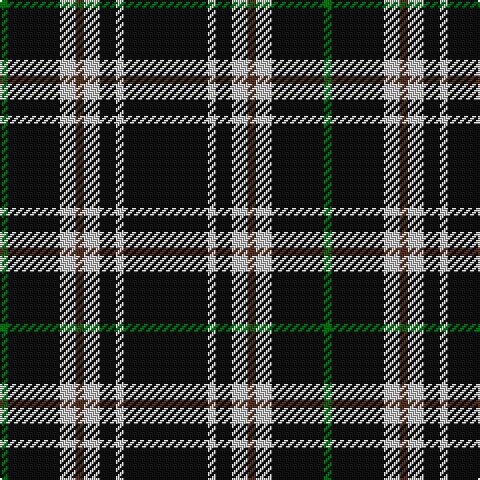

The parent of this is [Anzac (Fashion)](/tartans/g/4/k26/n8/t4/n8/k8/n4/k/42/)

This was sourced from tartans-authority.  It is a [8 stripes tartan](/stripes/stripes8/).

Original link http://www.tartansauthority.com/tartan-ferret/display/3042/

## Thread count
G/4 K26 N8 T4 N8 K8 N4 K/42

## Palette
Each colour and its ΔE from the base-6 reference it is a variant of.

| Colour | Shade | Base | ΔE (OKLab) |
|---|---|---|---|
| G |  `#006818` | G  | 0.02 |
| K |  `#101010` | K  | 0.17 |
| N |  `#C0C0C0` | W  | 0.16 |
| T |  `#4C3428` | B  | 0.16 |

# Sample pattern

ID: /variants/g/4/k26/n8/t4/n8/k8/n4/k/42-g006818-k101010-nc0c0c0-t4c3428/
