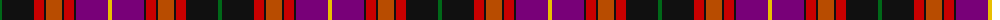

The parent of this is [Tribal (Corporate)](/tartans/g/4/k32/r10/k2/do16/k2/r10/k2/p32/y/4/)

This was sourced from tartans-authority.  It is a [10 stripes tartan](/stripes/stripes10/).

Original link http://www.tartansauthority.com/tartan-ferret/display/5886/

## Thread count
G/4 K32 R10 K2 DO16 K2 R10 K2 P32 Y/4

## Palette
Each colour and its ΔE from the base-6 reference it is a variant of.

| Colour | Shade | Base | ΔE (OKLab) |
|---|---|---|---|
| DO |  `#B84C00` | R  | 0.08 |
| G |  `#006818` | G  | 0.02 |
| K |  `#101010` | K  | 0.17 |
| P |  `#780078` | B  | 0.16 |
| R |  `#C80000` | R  | 0.00 |
| Y |  `#E8C000` | Y  | 0.00 |

ID: /variants/g/4/k32/r10/k2/do16/k2/r10/k2/p32/y/4-dob84c00-g006818-k101010-p780078-rc80000-ye8c000/
