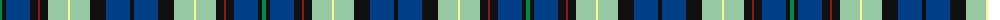

The parent of this is [Auchinachie](/tartans/g/4/k4/db24/k8/dr2/k8/n20/ly2/n20/k16/db24/k/4/)

This was sourced from register-of-tartans.  It is a [12 stripes tartan](/stripes/stripes12/).

Original link https://www.tartanregister.gov.uk/tartanDetails.aspx?ref=10014

## Thread count
G/4 K4 DB24 K8 DR2 K8 N20 LY2 N20 K16 DB24 K/4

## Palette
Each colour and its ΔE from the base-6 reference it is a variant of.

| Colour | Shade | Base | ΔE (OKLab) |
|---|---|---|---|
| DB |  `#003F87` | B  | 0.03 |
| DR |  `#8C1717` | R  | 0.12 |
| G |  `#008B45` | G  | 0.12 |
| K |  `#101010` | K  | 0.17 |
| LY |  `#FFF68F` | W  | 0.12 |
| N |  `#96C8A2` | Y  | 0.15 |

ID: /variants/g/4/k4/db24/k8/dr2/k8/n20/ly2/n20/k16/db24/k/4-db003f87-dr8c1717-g008b45-k101010-lyfff68f-n96c8a2/
