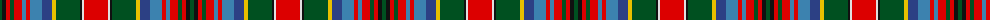

The parent of this is [Unidentified #31](/tartans/g/4/k4/r4/g4/r8/ba4/r4/ba12/b10/y4/g24/k2/ln2/r/24/)

This was sourced from register-of-tartans.  It is a [14 stripes tartan](/stripes/stripes14/).

Original link https://www.tartanregister.gov.uk/tartanDetails.aspx?ref=4232

## Thread count
G/4 K4 R4 G4 R8 Ba4 R4 Ba12 B10 Y4 G24 K2 LN2 R/24

## Palette
Each colour and its ΔE from the base-6 reference it is a variant of.

| Colour | Shade | Base | ΔE (OKLab) |
|---|---|---|---|
| B |  `#2C4084` | B  | 0.00 |
| Ba |  `#3C82AF` | B  | 0.20 |
| G |  `#005020` | G  | 0.08 |
| K |  `#101010` | K  | 0.17 |
| LN |  `#E0E0E0` | W  | 0.06 |
| R |  `#DC0000` | R  | 0.04 |
| Y |  `#E8C000` | Y  | 0.00 |

ID: /variants/g/4/k4/r4/g4/r8/ba4/r4/ba12/b10/y4/g24/k2/ln2/r/24-b2c4084-ba3c82af-g005020-k101010-lne0e0e0-rdc0000-ye8c000/
