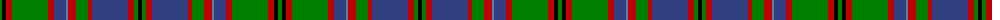

The parent of this is [Glen Orchy, or MacIntyre](/tartans/g/4/k4/r6/g36/r6/b12/ba2/r8/g12/r4/b36/r6/g4/k/4/)

This was sourced from weddslist.  It is a [14 stripes tartan](/stripes/stripes14/).

Original link http://www.weddslist.com/cgi-bin/tartans/pg.pl?source=sts

## Thread count
G/4 K4 R6 G36 R6 B12 Ba2 R8 G12 R4 B36 R6 G4 K/4

## Palette
Each colour and its ΔE from the base-6 reference it is a variant of.

| Colour | Shade | Base | ΔE (OKLab) |
|---|---|---|---|
| B |  `#304080` | B  | 0.01 |
| Ba |  `#5480B0` | B  | 0.20 |
| G |  `#008000` | G  | 0.09 |
| K |  `#000000` | K  | 0.00 |
| R |  `#C00000` | R  | 0.02 |

ID: /variants/g/4/k4/r6/g36/r6/b12/ba2/r8/g12/r4/b36/r6/g4/k/4-b304080-ba5480b0-g008000-k000000-rc00000/
