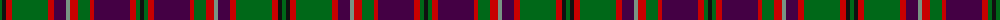

The parent of this is [MacIntyre and Glenorchy](/tartans/g/4/k4/r6/g36/r6/dp12/lg4/r8/g12/r4/dp36/r6/g4/k/4/)

This was sourced from register-of-tartans.  It is a [14 stripes tartan](/stripes/stripes14/).

Original link https://www.tartanregister.gov.uk/tartanDetails.aspx?ref=5059

## Thread count
G/4 K4 R6 G36 R6 DP12 LG4 R8 G12 R4 DP36 R6 G4 K/4

## Palette
Each colour and its ΔE from the base-6 reference it is a variant of.

| Colour | Shade | Base | ΔE (OKLab) |
|---|---|---|---|
| DG |  `#003820` | G  | 0.16 |
| DP |  `#440044` | B  | 0.17 |
| G |  `#006818` | G  | 0.02 |
| K |  `#101010` | K  | 0.17 |
| LG |  `#789484` | G  | 0.23 |
| R |  `#C80000` | R  | 0.00 |

ID: /variants/g/4/k4/r6/g36/r6/dp12/lg4/r8/g12/r4/dp36/r6/g4/k/4-dg003820-dp440044-g006818-k101010-lg789484-rc80000/
