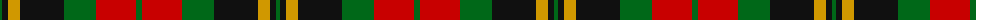

The parent of this is [Wcwm 1062](/tartans/g/4/k6/dy12/k44/g32/r40/g/6/)

This was sourced from register-of-tartans.  It is a [7 stripes tartan](/stripes/stripes7/).

Original link https://www.tartanregister.gov.uk/tartanDetails.aspx?ref=4508

## Thread count
G/4 K6 DY12 K44 G32 R40 G/6

## Palette
Each colour and its ΔE from the base-6 reference it is a variant of.

| Colour | Shade | Base | ΔE (OKLab) |
|---|---|---|---|
| DY |  `#D09800` | Y  | 0.11 |
| G |  `#006818` | G  | 0.02 |
| K |  `#101010` | K  | 0.17 |
| R |  `#C80000` | R  | 0.00 |

# Sample pattern

ID: /variants/g/4/k6/dy12/k44/g32/r40/g/6-dyd09800-g006818-k101010-rc80000/
