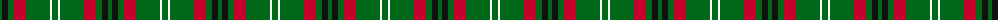

The parent of this is [Arkansas (Fashion)](/tartans/g/4/k6/g6/r12/g24/w2/g/6/)

This was sourced from tartans-authority.  It is a [7 stripes tartan](/stripes/stripes7/).

Original link http://www.tartansauthority.com/tartan-ferret/display/2678/

## Thread count
G/4 K6 G6 R12 G24 W2 G/6

## Palette
Each colour and its ΔE from the base-6 reference it is a variant of.

| Colour | Shade | Base | ΔE (OKLab) |
|---|---|---|---|
| G |  `#006818` | G  | 0.02 |
| K |  `#101010` | K  | 0.17 |
| R |  `#C8002C` | R  | 0.03 |
| W |  `#FCFCFC` | W  | 0.03 |

# Sample pattern

ID: /variants/g/4/k6/g6/r12/g24/w2/g/6-g006818-k101010-rc8002c-wfcfcfc/
