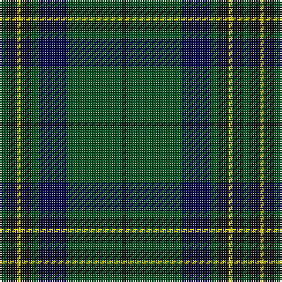

The parent of this is [Harley (Leslie), Robert](/tartans/g/4/k6/y2/k6/g4/db16/g32/k/2/)

This was sourced from register-of-tartans.  It is a [8 stripes tartan](/stripes/stripes8/).

Original link https://www.tartanregister.gov.uk/tartanDetails.aspx?ref=10986

## Thread count
G/4 K6 Y2 K6 G4 DB16 G32 K/2

## Palette
Each colour and its ΔE from the base-6 reference it is a variant of.

| Colour | Shade | Base | ΔE (OKLab) |
|---|---|---|---|
| DB |  `#000048` | B  | 0.21 |
| G |  `#005020` | G  | 0.08 |
| K |  `#101010` | K  | 0.17 |
| Y |  `#FFE600` | Y  | 0.10 |

# Sample pattern

ID: /variants/g/4/k6/y2/k6/g4/db16/g32/k/2-db000048-g005020-k101010-yffe600/
