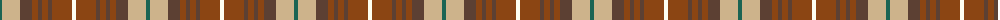

The parent of this is [Tinkler, Andrew (Stobart Group)](/tartans/g/4/lg18/ta12/t6/ta4/t6/ta4/t20/w/4/)

This was sourced from register-of-tartans.  It is a [9 stripes tartan](/stripes/stripes9/).

Original link https://www.tartanregister.gov.uk/tartanDetails.aspx?ref=10273

## Thread count
G/4 LG18 Ta12 T6 Ta4 T6 Ta4 T20 W/4

## Palette
Each colour and its ΔE from the base-6 reference it is a variant of.

| Colour | Shade | Base | ΔE (OKLab) |
|---|---|---|---|
| G |  `#1B6453` | G  | 0.09 |
| LG |  `#CDB38B` | Y  | 0.12 |
| T |  `#8B4513` | R  | 0.13 |
| Ta |  `#5C4033` | B  | 0.15 |
| W |  `#FFFFF0` | W  | 0.03 |

ID: /variants/g/4/lg18/ta12/t6/ta4/t6/ta4/t20/w/4-g1b6453-lgcdb38b-t8b4513-ta5c4033-wfffff0/
