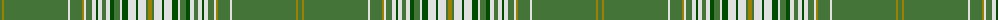

The parent of this is [Glen Elg (Fashion)](/tartans/g/4/lg2/g64/ln2/g12/lg2/ln2/g6/ln4/ga2/ln4/g4/ln4/ga4/g6/ln2/ga6/ln8/ga2/ln8/g2/lg/4/)

This was sourced from tartans-authority.  It is a [22 stripes tartan](/stripes/stripes22/).

Original link http://www.tartansauthority.com/tartan-ferret/display/5004/

## Thread count
G/4 LG2 G64 LN2 G12 LG2 LN2 G6 LN4 Ga2 LN4 G4 LN4 Ga4 G6 LN2 Ga6 LN8 Ga2 LN8 G2 LG/4

## Palette
Each colour and its ΔE from the base-6 reference it is a variant of.

| Colour | Shade | Base | ΔE (OKLab) |
|---|---|---|---|
| G |  `#447438` | G  | 0.09 |
| Ga |  `#004C00` | G  | 0.08 |
| LG |  `#9C8000` | G  | 0.21 |
| LN |  `#E0E0E0` | W  | 0.06 |

ID: /variants/g/4/lg2/g64/ln2/g12/lg2/ln2/g6/ln4/ga2/ln4/g4/ln4/ga4/g6/ln2/ga6/ln8/ga2/ln8/g2/lg/4-g447438-ga004c00-lg9c8000-lne0e0e0/
