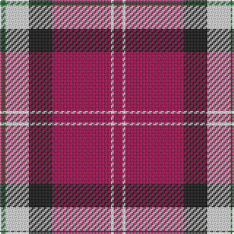

The parent of this is [Nisbet Dress, Rose (Dance)](/tartans/g/4/ln16/k16/r40/ln2/r/6/)

This was sourced from tartans-authority.  It is a [6 stripes tartan](/stripes/stripes6/).

Original link http://www.tartansauthority.com/tartan-ferret/display/946/

## Thread count
G/4 LN16 K16 R40 LN2 R/6

## Palette
Each colour and its ΔE from the base-6 reference it is a variant of.

| Colour | Shade | Base | ΔE (OKLab) |
|---|---|---|---|
| G |  `#006818` | G  | 0.02 |
| K |  `#101010` | K  | 0.17 |
| LN |  `#E0E0E0` | W  | 0.06 |
| R |  `#A00048` | R  | 0.11 |

# Sample pattern

ID: /variants/g/4/ln16/k16/r40/ln2/r/6-g006818-k101010-lne0e0e0-ra00048/
