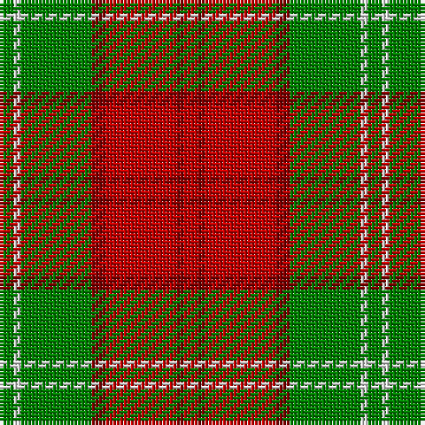

The parent of this is [Lennox](/tartans/g/4/ln2/g20/dr4/r20/dr2/r/4/)

This was sourced from weddslist.  It is a [7 stripes tartan](/stripes/stripes7/).

Original link http://www.weddslist.com/cgi-bin/tartans/pg.pl?source=sts

## Thread count
G/4 LN2 G20 DR4 R20 DR2 R/4

## Palette
Each colour and its ΔE from the base-6 reference it is a variant of.

| Colour | Shade | Base | ΔE (OKLab) |
|---|---|---|---|
| DR |  `#800000` | R  | 0.16 |
| G |  `#008000` | G  | 0.09 |
| LN |  `#E0E0E0` | W  | 0.06 |
| R |  `#C00000` | R  | 0.02 |

# Sample pattern

ID: /variants/g/4/ln2/g20/dr4/r20/dr2/r/4-dr800000-g008000-lne0e0e0-rc00000/
