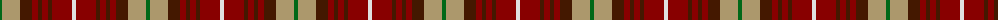

The parent of this is [Tinkler (Corporate)](/tartans/g/4/lt18/dra12/dr6/dra4/dr6/dra4/dr20/ln/4/)

This was sourced from tartans-authority.  It is a [9 stripes tartan](/stripes/stripes9/).

Original link http://www.tartansauthority.com/tartan-ferret/display/10273/

## Thread count
G/4 LT18 DRa12 DR6 DRa4 DR6 DRa4 DR20 LN/4

## Palette
Each colour and its ΔE from the base-6 reference it is a variant of.

| Colour | Shade | Base | ΔE (OKLab) |
|---|---|---|---|
| DR |  `#880000` | R  | 0.14 |
| DRa |  `#441800` | B  | 0.22 |
| G |  `#006818` | G  | 0.02 |
| LN |  `#E0E0E0` | W  | 0.06 |
| LT |  `#AC986C` | Y  | 0.17 |

ID: /variants/g/4/lt18/dra12/dr6/dra4/dr6/dra4/dr20/ln/4-dr880000-dra441800-g006818-lne0e0e0-ltac986c/
