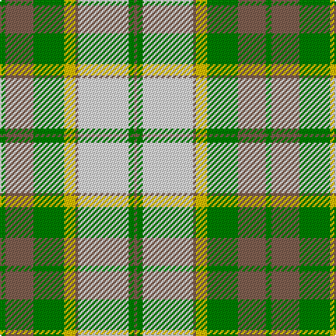

The parent of this is [Aviemore, Check](/tartans/g/4/lt20/g22/y8/lt2/ln36/g4/lt/2/)

This was sourced from weddslist.  It is a [8 stripes tartan](/stripes/stripes8/).

Original link http://www.weddslist.com/cgi-bin/tartans/pg.pl?source=sts

## Thread count
G/4 LT20 G22 Y8 LT2 LN36 G4 LT/2

## Palette
Each colour and its ΔE from the base-6 reference it is a variant of.

| Colour | Shade | Base | ΔE (OKLab) |
|---|---|---|---|
| G |  `#008000` | G  | 0.09 |
| LN |  `#E0E0E0` | W  | 0.06 |
| LT |  `#806050` | R  | 0.17 |
| Y |  `#F0C000` | Y  | 0.01 |

# Sample pattern

ID: /variants/g/4/lt20/g22/y8/lt2/ln36/g4/lt/2-g008000-lne0e0e0-lt806050-yf0c000/
