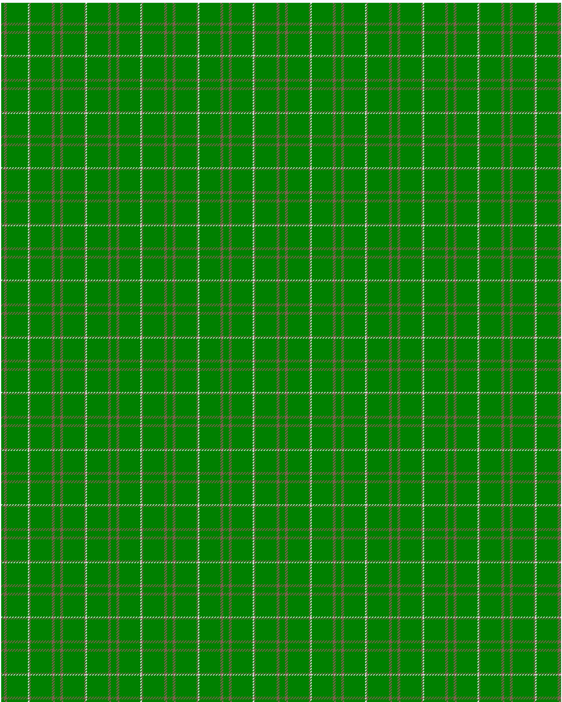

Bannockbane, hunting

This was sourced from <no value>.  It is a 8 stripes tartan.

Original link http://www.weddslist.com/cgi-bin/tartans/pg.pl?source=sts

## Thread count
G/4 LT4 G30 LN2 LT2 G30 LT4 G/4

## Palette
G#008000 LN#E0E0E0 LT#806050

# Sample pattern

ID: /variants/g/4/lt4/g30/ln2/lt2/g30/lt4/g/4-g008000-lne0e0e0-lt806050