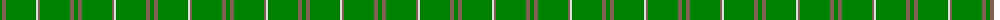
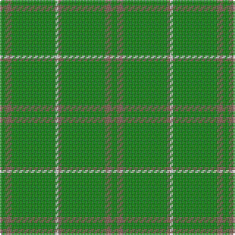

The parent of this is [Bannockbane, hunting](/tartans/g/4/lt4/g30/ln2/lt2/g30/lt4/g/4/)

This was sourced from weddslist.  It is a [8 stripes tartan](/stripes/stripes8/).

Original link http://www.weddslist.com/cgi-bin/tartans/pg.pl?source=sts

## Thread count
G/4 LT4 G30 LN2 LT2 G30 LT4 G/4

## Palette
Each colour and its ΔE from the base-6 reference it is a variant of.

| Colour | Shade | Base | ΔE (OKLab) |
|---|---|---|---|
| G |  `#008000` | G  | 0.09 |
| LN |  `#E0E0E0` | W  | 0.06 |
| LT |  `#806050` | R  | 0.17 |

# Sample pattern

ID: /variants/g/4/lt4/g30/ln2/lt2/g30/lt4/g/4-g008000-lne0e0e0-lt806050/
