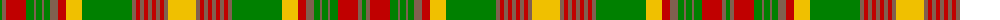

The parent of this is [Ontario](/tartans/g/4/lt4/r20/g8/lt2/g6/lt2/g6/lt8/r8/y16/g50/lt4/r4/lt4/r4/lt4/r4/lt4/r4/lt4/y/28/)

This was sourced from weddslist.  It is a [22 stripes tartan](/stripes/stripes22/).

Original link http://www.weddslist.com/cgi-bin/tartans/pg.pl?source=sts

## Thread count
G/4 LT4 R20 G8 LT2 G6 LT2 G6 LT8 R8 Y16 G50 LT4 R4 LT4 R4 LT4 R4 LT4 R4 LT4 Y/28

## Palette
Each colour and its ΔE from the base-6 reference it is a variant of.

| Colour | Shade | Base | ΔE (OKLab) |
|---|---|---|---|
| G |  `#008000` | G  | 0.09 |
| LT |  `#806050` | R  | 0.17 |
| R |  `#C00000` | R  | 0.02 |
| Y |  `#F0C000` | Y  | 0.01 |

ID: /variants/g/4/lt4/r20/g8/lt2/g6/lt2/g6/lt8/r8/y16/g50/lt4/r4/lt4/r4/lt4/r4/lt4/r4/lt4/y/28-g008000-lt806050-rc00000-yf0c000/
