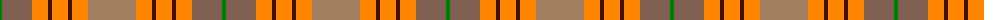
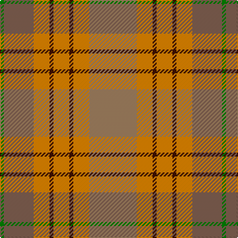

The parent of this is [Unidentified from Winnipeg](/tartans/g/4/lta30/o16/dr4/o16/dr4/o16/lt/48/)

This was sourced from weddslist.  It is a [8 stripes tartan](/stripes/stripes8/).

Original link http://www.weddslist.com/cgi-bin/tartans/pg.pl?source=sts

## Thread count
G/4 LTa30 O16 DR4 O16 DR4 O16 LT/48

## Palette
Each colour and its ΔE from the base-6 reference it is a variant of.

| Colour | Shade | Base | ΔE (OKLab) |
|---|---|---|---|
| DR |  `#401000` | B  | 0.23 |
| G |  `#008000` | G  | 0.09 |
| LT |  `#A08060` | R  | 0.20 |
| LTa |  `#806050` | R  | 0.17 |
| O |  `#FF8500` | Y  | 0.14 |

# Sample pattern

ID: /variants/g/4/lta30/o16/dr4/o16/dr4/o16/lt/48-dr401000-g008000-lta08060-lta806050-off8500/
