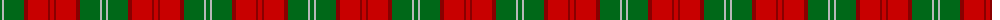
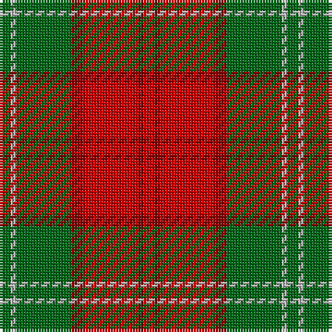

The parent of this is [Lennox (District & Clan)](/tartans/g/4/n2/g20/dr4/r20/dr2/r/4/)

This was sourced from tartans-authority.  It is a [7 stripes tartan](/stripes/stripes7/).

Original link http://www.tartansauthority.com/tartan-ferret/display/935/

## Thread count
G/4 N2 G20 DR4 R20 DR2 R/4

## Palette
Each colour and its ΔE from the base-6 reference it is a variant of.

| Colour | Shade | Base | ΔE (OKLab) |
|---|---|---|---|
| DR |  `#880000` | R  | 0.14 |
| G |  `#006818` | G  | 0.02 |
| N |  `#B8B8B8` | Y  | 0.17 |
| R |  `#C80000` | R  | 0.00 |

# Sample pattern

ID: /variants/g/4/n2/g20/dr4/r20/dr2/r/4-dr880000-g006818-nb8b8b8-rc80000/
